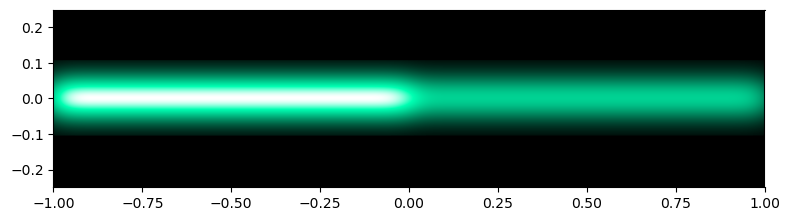
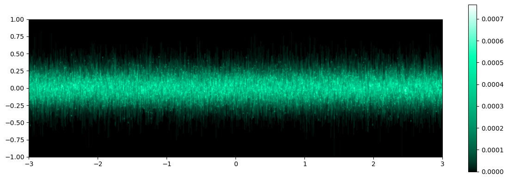
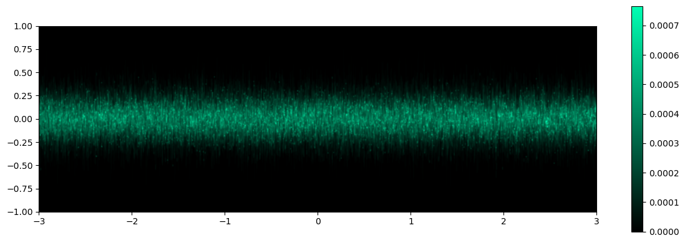
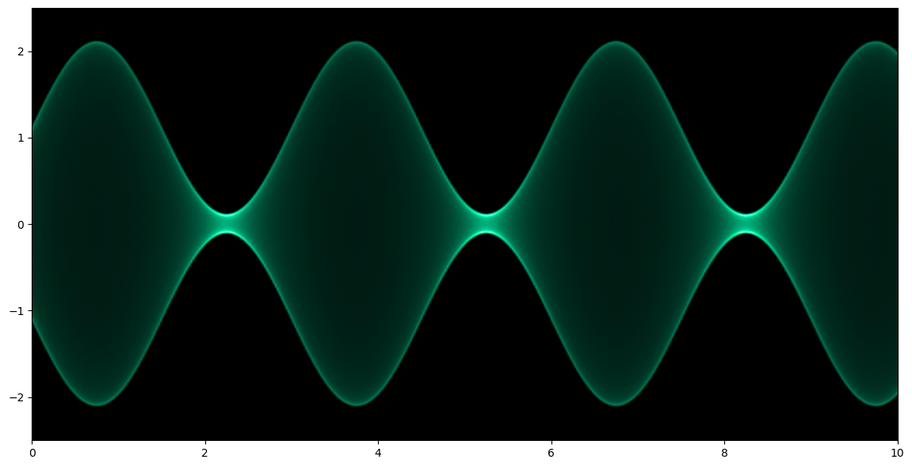
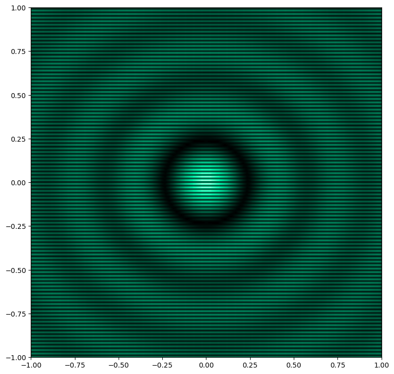

# cro_sim_plot

Simulation of a cathode ray oscilloscope (CRO) display.

## Description
The ususal 2D plotting methods take a number of `(x, y)` points and draw them as dots/markers and/or connect them with lines. A CRO does something similar, physically, but not quite the same: An electron beam is positioned on the backside of the screen according to the `(x, y)` input voltages where the impinging electrons cause the phospor to emit light. Assuming the image on the CRO to be periodically redrawn, the perceived brightness at each screen location depends on the average time the beam spends on this location (or in the case of random signals, the probability of occurrence of the particular (x, y) combination). This information is missing in a `xy`-plot connecting points with lines. Especially when the signal details cannot be resolved (e.g., due to the finite line thickess), large portions of the plot can end up as uniformly colored areas without meaningful details.

Many modern scopes also perform some signal processing to obtain a "more CRO like" display.

## Examples
The file `cro_sim_plot_test.py` contains some examples.

### Sweep Speed dependence

In this figure (using a really fat beam), the beam traverses the screen from left to right and the speed in the right half is twice the speed in the left half. Consequently, the left part of the image is brighter. The point spread function (Gaussian function) is also clearly visible with a wide beam. The brightness impression strongly depends on the applied colormap. See the Gaussian noise example for more details.

### Gaussian Noise

White Gaussian noise is an example where the brightness modulation is well visible. The part near the horizontal axis is brighter, because the probability of those values is higher.

A nonlinear colormap containing a "bloom to white" portion at the high end is used by default, making the bright spots more pronounced. See the documentation of `cmap_color_white` for more details.

The following image shows the same data, but with a colormap from black to full color saturation without the white part:

### Amplitude Modulation

The beam spends more time at the crest of the sine wave, such that the envelope of the sine is brighter even though the frequency is too high for resolving individual periods. Where the sine is "compressed", the beam moves slower, so these regions are brighter, too.

### Beam Intensity Modulation
The plotting function also supports modulation of the simulated beam (as many CROs do) with externally supplied data. See, for example, this raster-like image:

## License
GPL V3 or later for `cro_sim_plot_test.py`, LGPL V3 or later for `cro_sim_plot.py`.

